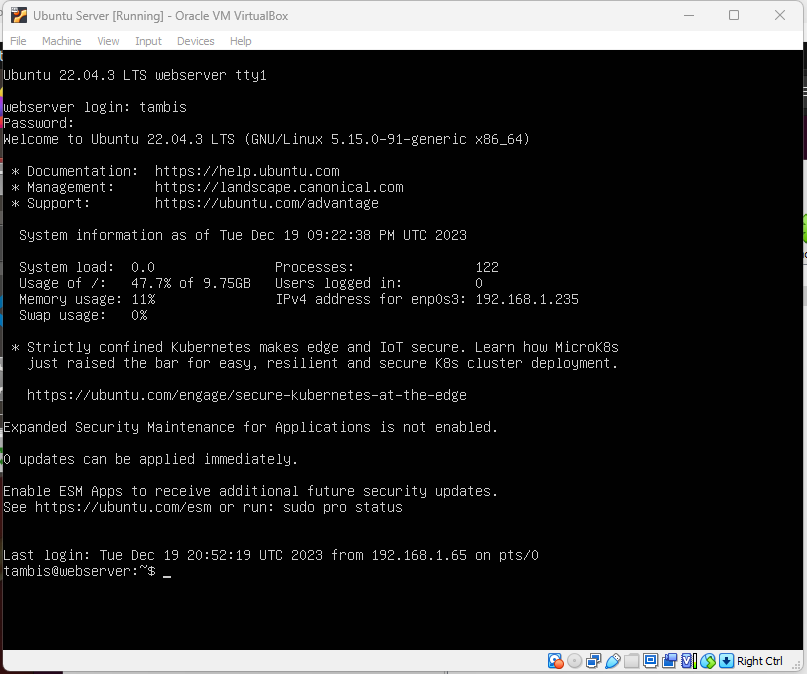

name: Tambi Samkough
semester: Fall 23
class: cis106

## Questions

### Question 1
 
 
 
 
### Question 2
 
 
### Question 3
 
### Question 4
 
### Question 5
 
### Question 6
 
### Question 7
 
### Question 8
 
### Question 9
 
### Question 10
 
### Question 11
 
### Question 12
 
### Question 13
 
### Question 14
- systemctl - Used to control and interact with Linux services via the systemd service manager
- journalctl - Used to query and view the logs that are generated by systemd
- apachectl - When troubleshooting, this command is used to check Apache's configuration
### Question 15
Apache log files are a very helpful resource for troubleshooting. Generally, any error that you receive in a browser or other HTTP client will have a corresponding entry in Apache’s logs. Sometimes Apache will also output errors related to configuration, built-in modules, and other debugging information to its log files.
 