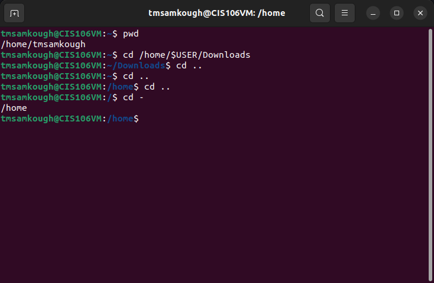
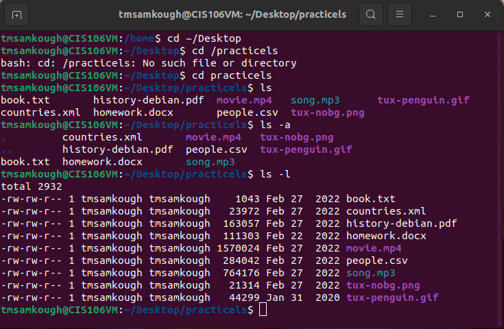
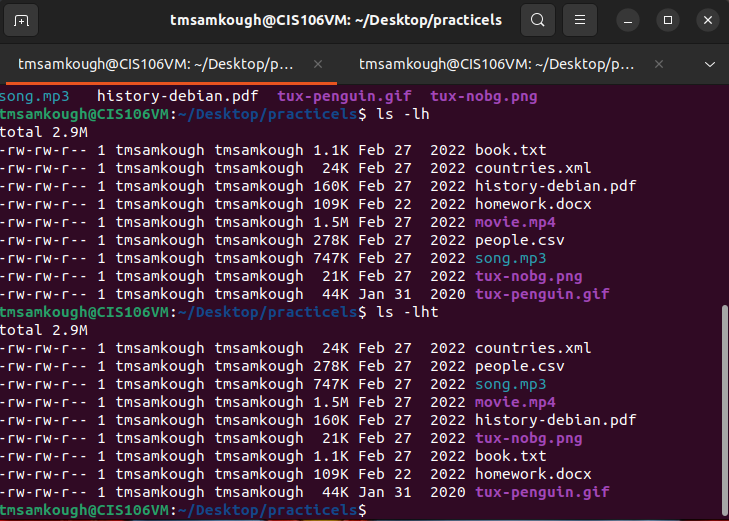
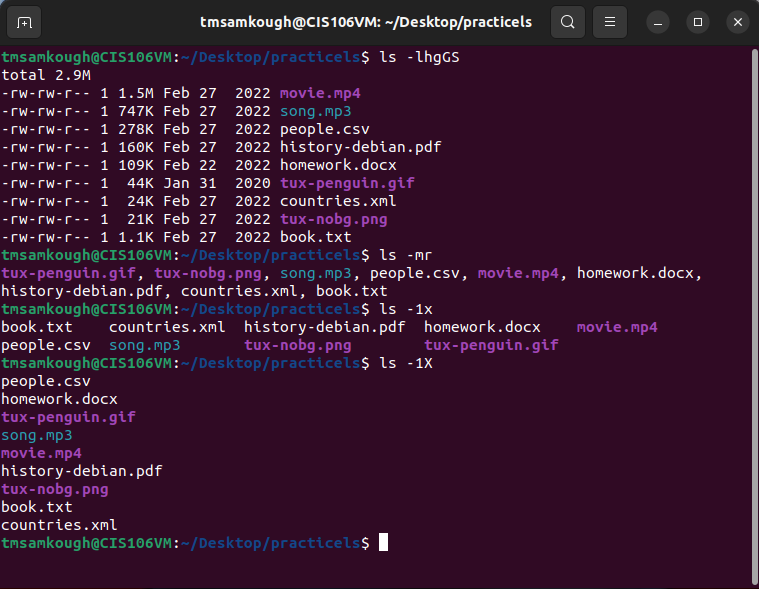

# Week Report 4

## Practice from the presentation The Linux File System:
### Practice 1
 

### Practice Question 2
 
 
 

### Practice 3

## The Linux File system directories and their purpose

 
 
 

## All the commands for navigating the filesystem

| Command | What it does| Syntax | Example |
| ------- | ------------------------ | --- | --- |
| pwd     | prints current directory | pwd | 'pwd' |
| cd | used for changing the current working directory | cd | cd /tmsamkough |
| ls | used for display all files in a listed directory | ls | ls -S |

### Terminology
File System : The way files are stored and organized
current Directory : the directory you are at the moment 
parent directory : the primary directory or top directory of other sub directories
Difference between YOUR HOME Directory and the HOME DIRECTORY : Home directory is just /home while my home directory is /home/tmsamkough
pathname : location of the file in a file system
relative path : the location of a file starting from the current working directory or a directory that is located inside the current working directory
absolute path : the location of a file starting a the root of the file system
