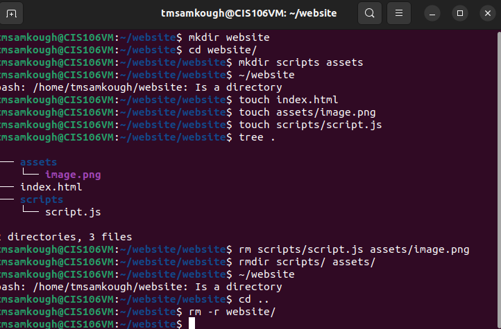
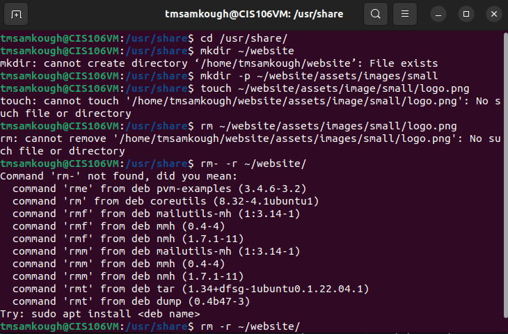
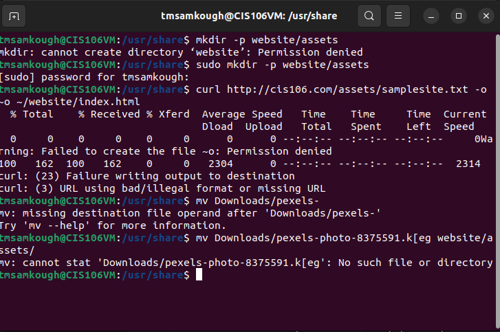
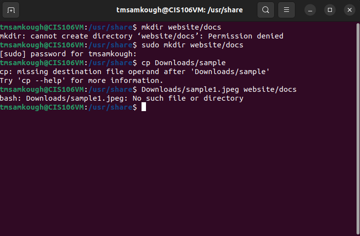
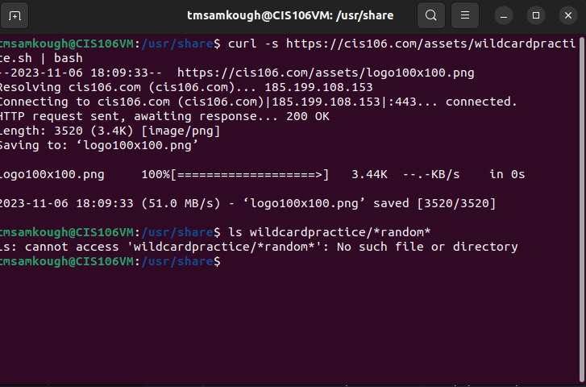

# Week Reports
   ## Answer these questions
    What are Command Options? : Options are commands that modify/enhance the commands behavior
    What are Command Arguments? : Items that the commands act on. 
    Which command is used for creating directories? Provide at least 3 examples. : mkdir - mkdir home/Punchas - mkdir ~/home/Punchas - mkdir home/"Punchas"
    What does the touch command do? Provide at least 3 examples. Create files - touch list - touch ~/Downloads/games.txt - touch "list of foods.txt"
    How do you remove a file? Provide an example. rm - rm Punchas
    How do you remove a directory and can you remove non-empty directories in Linux? Provide an example -rm -rm Pinkes
    Explain the mv and cp command. Provide at least 2 examples of each : mv moves and renames directories - mv Downloads/homework.pdf Documents/ - sudo mv ~/Downloads/theme/usr/share/themes. cp copies files/directories from a source to a destination - cp Downloads/wallpapers.zip Pictures/ - cp -r ~/Downloads/wallpapers ~/Pictures/

### Practice Questions

## Question 1
 

## Question 2
 

## Question 3
 

## Question 4
 

## Question 5
 
